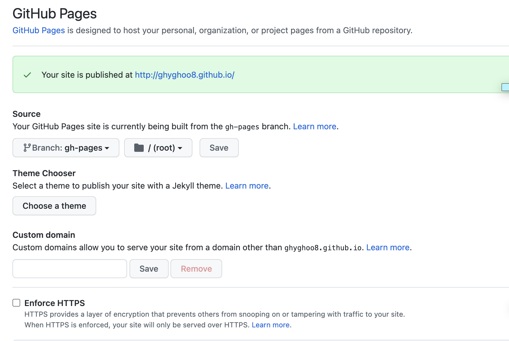
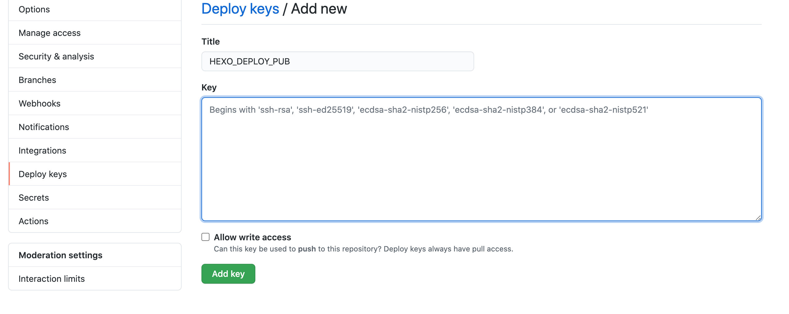
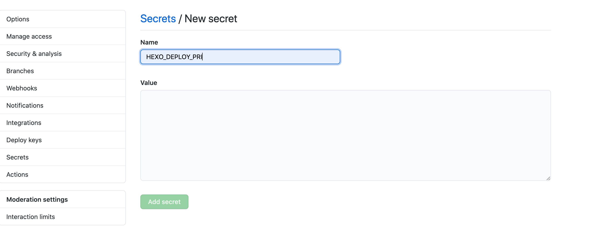

#### hexo操作
* 安装hexo：
  * ```npm install -g hexo-cli```
  * ```hexo init myBlog```
  * 生成文件目录
  ```
    .
  ├── _config.yml # 网站的配置信息，您可以在此配置大部分的参数。 
  ├── package.json
  ├── scaffolds # 模版文件夹
  ├── source  # 资源文件夹，除 _posts 文件，其他以下划线_开头的文件或者文件夹不会被编译打包到public文件夹
  |   ├── _drafts # 草稿文件
  |   └── _posts # 文章Markdowm文件 
  └── themes  # 主题文件夹
  ``` 
  * 本地预览：```hexo s```

#### github操作
* 创建仓库
* 将该仓库设置为静态站点托管。
  * 点击仓库菜单```Settings```->```Pages```
  * **注意：Github 仅能使用一个同名仓库的代码托管一个静态站点**

* 在本地仓库生成公钥私钥
  * ```ssh-keygen -t rsa  -C "$(git config user.name)" -f github-deploy-key```
* 添加仓库变量
  * 设置HEXO_DEPLOY_PUB，value 是上步生成的 github-deploy-key.pub 文件内容
  
  * 设置HEXO_DEPLOY_PRI，value 是上步生成的 github-deploy-key 文件内容
  
* 添加 workflow, 文件路径为```root/.github/workflows/deploy.yml```
```yml

name: CI

on:
  push:
    branches:
      - master

env:
  GIT_USER: ghyghoo8
  GIT_EMAIL: ghyghoo8@qq.com
  THEME_REPO: theme-next/hexo-theme-next
  THEME_BRANCH: master
  DEPLOY_REPO: ghyghoo8/ghyghoo8.github.com
  DEPLOY_BRANCH: master

jobs:
  build:
    name: Build on node ${{ matrix.node_version }} and ${{ matrix.os }}
    runs-on: ubuntu-latest
    strategy:
      matrix:
        os: [ubuntu-latest]
        node_version: [14.x]

    steps:
      - name: Checkout
        uses: actions/checkout@v2

      - name: Checkout theme repo
        uses: actions/checkout@v2
        with:
          repository: ${{ env.THEME_REPO }}
          ref: ${{ env.THEME_BRANCH }}
          path: themes/next

      - name: Checkout deploy repo
        uses: actions/checkout@v2
        with:
          repository: ${{ env.DEPLOY_REPO }}
          ref: ${{ env.DEPLOY_BRANCH }}
          path: .deploy_git

      - name: Use Node.js ${{ matrix.node_version }}
        uses: actions/setup-node@v1
        with:
          node-version: ${{ matrix.node_version }}

      - name: Configuration environment
        env:
          HEXO_DEPLOY_PRI: ${{secrets.HEXO_DEPLOY_PRI}}
        run: |
          sudo timedatectl set-timezone "Asia/Shanghai"
          mkdir -p ~/.ssh/
          echo "$HEXO_DEPLOY_PRI" > ~/.ssh/id_rsa
          chmod 600 ~/.ssh/id_rsa
          ssh-keyscan github.com >> ~/.ssh/known_hosts
          git config --global user.name $GIT_USER
          git config --global user.email $GIT_EMAIL
          cp _config.theme.yml themes/next/_config.yml

      - name: Install dependencies
        run: |
          npm install

      - name: Deploy hexo
        env: 
          GITHUB_TOKEN: ${{secrets.HEXO_DEPLOY_PRI}}
        run: |
          rm -rf .deploy_git
          npm run deploy

```

* 在```_config.yml``文件配置下新增配置，支持github自动部署
```
# Deployment
## Docs: https://hexo.io/docs/one-command-deployment
deploy:
  type: git
  repo:
    github:
      url: https://github.com/ghyghoo8/ghyghoo8.github.com.git
      branch: gh-pages
      token: $GITHUB_TOKEN

```

